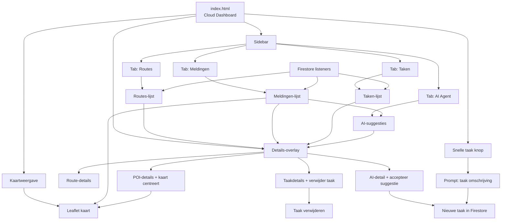

# Veegtracker Pro webstructuur

De webinterface staat in `app/src/main/assets/web/index.html` en is een single-page dashboard. Er zijn geen aparte URL-pagina's; navigatie gebeurt binnen dezelfde pagina via tabs, overlays en acties.

## Navigatiestromen

1. `index.html` opent direct het dashboard met standaard de tab `Routes`.
2. Klik op `Routes`, `Meldingen`, `Taken` of `AI Agent` wisselt alleen de inhoud van de lijst binnen dezelfde pagina.
3. Klik op een lijstitem opent de details-overlay rechtsboven.
4. Vanuit `Meldingen` zoomt de kaart naar de gekozen melding.
5. Vanuit `AI Agent` kan een suggestie worden geaccepteerd, wat een taak aanmaakt.
6. Vanuit `SNELLE TAAK MAKEN` kan direct een nieuwe taak worden toegevoegd.
7. Vanuit `Taken` kan een bestaande taak weer worden verwijderd.
